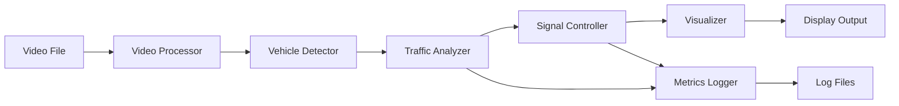

# Design Document

## Overview

SMART FLOW is a Python-based traffic signal simulation system that demonstrates adaptive traffic management using computer vision and AI. The system processes pre-recorded intersection video, detects vehicles using YOLO, calculates lane-wise traffic density, and simulates intelligent signal timing decisions. The architecture follows a modular pipeline design where each component has a single responsibility and communicates through well-defined interfaces.

## Architecture

The system follows a pipeline architecture with four main stages:

```
Video Input → Vehicle Detection → Traffic Analysis → Signal Control → Visualization
```

### High-Level Architecture Diagram



### Component Responsibilities

1. **Video Processor**: Loads video, extracts frames, manages playback
2. **Vehicle Detector**: Runs YOLO model, generates bounding boxes, counts vehicles
3. **Traffic Analyzer**: Calculates density, identifies congestion patterns
4. **Signal Controller**: Allocates green time, manages signal state machine
5. **Visualizer**: Renders detection results and signal states
6. **Metrics Logger**: Records performance data for analysis

## Components and Interfaces

### 1. Video Processor

**Purpose**: Handle video file I/O and frame extraction

**Interface**:
```python
class VideoProcessor:
    def __init__(self, video_path: str)
    def load_video(self) -> bool
    def get_next_frame(self) -> Optional[Frame]
    def get_frame_metadata(self) -> FrameMetadata
    def release(self) -> None
```

**Key Methods**:
- `load_video()`: Validates and opens video file using OpenCV
- `get_next_frame()`: Returns next frame or None if video ends
- `get_frame_metadata()`: Returns frame number, timestamp, resolution, FPS

### 2. Vehicle Detector

**Purpose**: Detect and count vehicles using YOLO

**Interface**:
```python
class VehicleDetector:
    def __init__(self, model_path: str, confidence_threshold: float = 0.5)
    def detect(self, frame: Frame) -> List[Detection]
    def count_by_lane(self, detections: List[Detection], lane_regions: Dict[str, Region]) -> Dict[str, int]
```

**Key Methods**:
- `detect()`: Runs YOLO inference, returns list of Detection objects
- `count_by_lane()`: Maps detections to lanes based on spatial position

**Detection Object**:
```python
@dataclass
class Detection:
    bbox: Tuple[int, int, int, int]  # x, y, width, height
    confidence: float
    class_name: str
    lane: Optional[str]
```

### 3. Traffic Analyzer

**Purpose**: Calculate traffic density and identify congestion

**Interface**:
```python
class TrafficAnalyzer:
    def calculate_density(self, lane_counts: Dict[str, int]) -> Dict[str, float]
    def identify_max_density_lane(self, densities: Dict[str, float]) -> str
    def get_density_ratios(self, densities: Dict[str, float]) -> Dict[str, float]
```

**Key Methods**:
- `calculate_density()`: Converts vehicle counts to density values
- `identify_max_density_lane()`: Returns lane with highest density
- `get_density_ratios()`: Returns normalized density ratios for signal allocation

### 4. Signal Controller

**Purpose**: Manage signal states and timing allocation

**Interface**:
```python
class SignalController:
    def __init__(self, min_green: int = 10, max_green: int = 60, yellow_duration: int = 3)
    def allocate_green_time(self, density_ratios: Dict[str, float]) -> Dict[str, int]
    def update_state(self, elapsed_time: float) -> None
    def get_current_states(self) -> Dict[str, SignalState]
    def start_cycle(self, green_times: Dict[str, int]) -> None
```

**Signal State Machine**:
```python
class SignalState(Enum):
    RED = "red"
    YELLOW = "yellow"
    GREEN = "green"
```

**Key Methods**:
- `allocate_green_time()`: Calculates green time based on density ratios
- `update_state()`: Advances signal state machine based on elapsed time
- `get_current_states()`: Returns current signal state for all lanes

### 5. Visualizer

**Purpose**: Render detection results and signal states

**Interface**:
```python
class Visualizer:
    def draw_detections(self, frame: Frame, detections: List[Detection]) -> Frame
    def draw_signal_states(self, frame: Frame, states: Dict[str, SignalState], remaining_times: Dict[str, int]) -> Frame
    def draw_vehicle_counts(self, frame: Frame, counts: Dict[str, int]) -> Frame
    def display(self, frame: Frame) -> bool
```

**Key Methods**:
- `draw_detections()`: Overlays bounding boxes on frame
- `draw_signal_states()`: Renders signal indicators with colors
- `draw_vehicle_counts()`: Displays count text for each lane
- `display()`: Shows frame in window, returns False if user closes window

### 6. Metrics Logger

**Purpose**: Record simulation data for analysis

**Interface**:
```python
class MetricsLogger:
    def __init__(self, output_path: str)
    def log_density(self, timestamp: float, densities: Dict[str, float]) -> None
    def log_signal_allocation(self, timestamp: float, green_times: Dict[str, int]) -> None
    def log_state_transition(self, timestamp: float, lane: str, old_state: SignalState, new_state: SignalState) -> None
    def finalize(self) -> None
```

**Key Methods**:
- `log_density()`: Records density measurements
- `log_signal_allocation()`: Records green time decisions
- `log_state_transition()`: Records signal state changes
- `finalize()`: Calculates summary statistics and writes to file

## Data Models

### Frame
```python
@dataclass
class Frame:
    image: np.ndarray  # OpenCV image array
    frame_number: int
    timestamp: float
```

### FrameMetadata
```python
@dataclass
class FrameMetadata:
    frame_number: int
    timestamp: float
    width: int
    height: int
    fps: float
```

### Region
```python
@dataclass
class Region:
    x: int
    y: int
    width: int
    height: int
    lane_name: str
```

### LaneConfiguration
```python
@dataclass
class LaneConfiguration:
    lanes: Dict[str, Region]  # Maps lane name to spatial region
    
    @staticmethod
    def create_four_way() -> LaneConfiguration:
        """Creates default 4-way intersection configuration"""
```

## Correctness Properties

*A property is a characteristic or behavior that should hold true across all valid executions of a system—essentially, a formal statement about what the system should do. Properties serve as the bridge between human-readable specifications and machine-verifiable correctness guarantees.*


### Property 1: Video frame extraction preserves order
*For any* video file, extracting frames sequentially should produce monotonically increasing frame numbers.
**Validates: Requirements 1.2**

### Property 2: Frame metadata preservation
*For any* video file, the extracted frame metadata (resolution, FPS) should match the original video properties.
**Validates: Requirements 1.3**

### Property 3: Invalid video rejection
*For any* corrupted or unsupported video file, the system should reject it with an error message and not crash.
**Validates: Requirements 1.4**

### Property 4: Detection produces bounding boxes
*For any* frame processed by the detector, each vehicle detection should have a corresponding bounding box with valid coordinates.
**Validates: Requirements 2.2**

### Property 5: Lane classification is exhaustive and exclusive
*For any* detection within the frame boundaries, it should be assigned to exactly one lane based on its spatial position.
**Validates: Requirements 2.3**

### Property 6: Vehicle counting increments correctly
*For any* lane, adding N detections to that lane should increase the count by N.
**Validates: Requirements 2.4**

### Property 7: Low confidence detections are filtered
*For any* detection with confidence below the threshold, it should not contribute to the vehicle count.
**Validates: Requirements 2.5**

### Property 8: Density calculation completeness
*For any* set of vehicle counts across four lanes, the density calculation should produce exactly four density values.
**Validates: Requirements 3.1**

### Property 9: Maximum density identification
*For any* set of lane densities where one lane has strictly higher density than others, that lane should be identified as the maximum.
**Validates: Requirements 3.2**

### Property 10: Tie-breaking consistency
*For any* set of equal lane densities, running the tie-breaking algorithm multiple times should always select the same lane.
**Validates: Requirements 3.3**

### Property 11: Green time proportional to density
*For any* two lanes where lane A has higher density than lane B, lane A should receive greater or equal green time allocation.
**Validates: Requirements 4.2**

### Property 12: Green time bounds enforcement
*For any* green time allocation, all lane green times should be between 10 and 60 seconds inclusive.
**Validates: Requirements 4.3, 4.4**

### Property 13: Yellow duration is constant
*For any* signal cycle, the yellow signal duration should be exactly 3 seconds for all lanes.
**Validates: Requirements 4.5**

### Property 14: Signal state machine correctness
*For any* lane, the signal state transitions should follow the sequence: green → yellow (3s) → red, and never skip states.
**Validates: Requirements 5.3, 5.4**

### Property 15: Mutual exclusion of green signals
*For any* point in time during simulation, at most one lane should be in green or yellow state, while all others are red.
**Validates: Requirements 5.5**

### Property 16: State transitions are logged
*For any* signal state change, a log entry should be created containing the timestamp, lane identifier, old state, and new state.
**Validates: Requirements 5.6**

### Property 17: Visualization completeness
*For any* rendered frame, the output should contain bounding boxes for all detections, vehicle counts for all lanes, signal states for all lanes, and remaining time display.
**Validates: Requirements 6.1, 6.2, 6.3, 6.4**

### Property 18: Cycle metrics are logged
*For any* signal cycle, the system should log both the density measurements and green time allocations for all four lanes.
**Validates: Requirements 7.1, 7.2**

### Property 19: Summary statistics completeness
*For any* completed simulation, the final log should contain both average waiting time per lane and total signal cycles executed.
**Validates: Requirements 7.3, 7.4**

### Property 20: Log format validity
*For any* log file produced by the system, it should be parseable as valid JSON or CSV format.
**Validates: Requirements 7.5**

## Error Handling

### Video Processing Errors
- **Invalid file path**: Return error message, do not crash
- **Corrupted video**: Detect during load, report error gracefully
- **Unsupported codec**: Check format, provide helpful error message
- **End of video**: Return None from `get_next_frame()`, allow clean shutdown

### Detection Errors
- **Model loading failure**: Check model file exists, report clear error
- **Inference failure**: Log error, skip frame, continue processing
- **Invalid bounding box**: Validate coordinates, discard invalid detections
- **Memory issues**: Implement frame batching if needed

### Signal Control Errors
- **Invalid density values**: Validate inputs, use default allocation if needed
- **Timing overflow**: Enforce max green time constraint
- **State machine deadlock**: Implement timeout and reset mechanism

### Visualization Errors
- **Display window closed**: Detect close event, trigger graceful shutdown
- **Rendering failure**: Log error, continue without visualization
- **Font/color errors**: Use fallback rendering options

### Logging Errors
- **File write failure**: Report error but continue simulation
- **Disk full**: Catch exception, notify user, continue without logging
- **Invalid data format**: Validate before writing, skip invalid entries

## Testing Strategy

### Unit Testing
We will use **pytest** as the testing framework for Python. Unit tests will cover:

- **Video Processor**: Test frame extraction, metadata parsing, error handling for invalid files
- **Vehicle Detector**: Test detection filtering, lane classification logic, bounding box validation
- **Traffic Analyzer**: Test density calculation, max identification, tie-breaking rules
- **Signal Controller**: Test green time allocation algorithm, state machine transitions, timing constraints
- **Visualizer**: Test rendering functions with mock frames and detections
- **Metrics Logger**: Test log writing, format validation, summary statistics calculation

Unit tests will focus on specific examples and edge cases:
- Empty video files
- Single-frame videos
- Videos with no vehicles detected
- Equal density across all lanes
- Extreme density values (very high/low)
- State machine edge cases (immediate transitions)

### Property-Based Testing
We will use **Hypothesis** for property-based testing in Python. Property tests will verify universal properties across randomly generated inputs:

- Each correctness property from the design document will be implemented as a property-based test
- Each test will run a minimum of 100 iterations with randomly generated inputs
- Each property test will be tagged with a comment in this format: `# Feature: smart-flow-traffic, Property {number}: {property_text}`
- Property tests will use Hypothesis strategies to generate:
  - Random video metadata (frame counts, resolutions, FPS values)
  - Random detection sets with varying confidence levels
  - Random vehicle counts and density distributions
  - Random signal timing scenarios

Example property test structure:
```python
from hypothesis import given, strategies as st

# Feature: smart-flow-traffic, Property 6: Vehicle counting increments correctly
@given(st.integers(min_value=0, max_value=100))
def test_vehicle_counting_increments(n_vehicles):
    lane_counter = LaneCounter()
    initial_count = lane_counter.get_count("north")
    
    for _ in range(n_vehicles):
        lane_counter.add_vehicle("north")
    
    assert lane_counter.get_count("north") == initial_count + n_vehicles
```

### Integration Testing
- End-to-end test with sample video file
- Verify complete pipeline from video input to log output
- Validate that all components work together correctly
- Test with different video formats and resolutions

### Performance Testing
- Measure frame processing rate (FPS)
- Monitor memory usage during long simulations
- Ensure real-time processing capability (>= 30 FPS)
- Test with high-resolution videos (1080p, 4K)

## Implementation Notes

### YOLO Model Selection
- Use **YOLOv8** (ultralytics) for best balance of speed and accuracy
- Pre-trained on COCO dataset (includes vehicle classes)
- Model size: YOLOv8n (nano) for speed, YOLOv8m (medium) for accuracy
- Classes to detect: car, truck, bus, motorcycle

### Lane Region Configuration
- Define lane regions as rectangular areas in the frame
- Default 4-way intersection: divide frame into quadrants
- Allow custom configuration via JSON file for different intersection layouts
- Use center point of bounding box for lane assignment

### Signal Timing Algorithm
```python
def allocate_green_time(densities: Dict[str, float]) -> Dict[str, int]:
    total_density = sum(densities.values())
    if total_density == 0:
        # Equal allocation if no vehicles
        return {lane: 15 for lane in densities.keys()}
    
    # Proportional allocation
    base_time = 40  # Total time to distribute
    green_times = {}
    for lane, density in densities.items():
        ratio = density / total_density
        time = int(base_time * ratio)
        # Enforce bounds
        green_times[lane] = max(10, min(60, time))
    
    return green_times
```

### Visualization Layout
```
+----------------------------------+
|                                  |
|     Video with Bounding Boxes    |
|                                  |
+----------------------------------+
| North: 12 vehicles | [GREEN] 15s|
| South: 8 vehicles  | [RED]       |
| East:  15 vehicles | [RED]       |
| West:  5 vehicles  | [RED]       |
+----------------------------------+
```

### Dependencies
```
opencv-python==4.8.0
ultralytics==8.0.0
numpy==1.24.0
pytest==7.4.0
hypothesis==6.82.0
```

## Future Enhancements (Post-MVP)

- Multi-intersection coordination
- Pedestrian detection and crosswalk signals
- Emergency vehicle priority
- Historical data analysis and prediction
- Web-based dashboard for monitoring
- Integration with actual traffic light hardware via GPIO/API
- Machine learning for traffic pattern prediction
- Adaptive learning from historical performance
