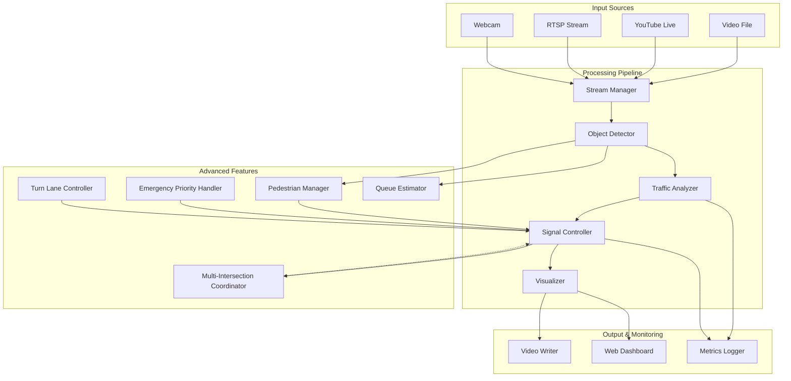

# Design Document

## Overview

SMART FLOW v2 is an advanced Python-based traffic signal management system that extends the original SMART FLOW with production-ready features. The system supports multiple video input sources (files, live streams, webcams), detects vehicles and pedestrians, manages complex intersection scenarios including turn lanes and emergency vehicles, coordinates multiple intersections, and provides real-time monitoring through a web dashboard. The architecture maintains modularity while adding sophisticated traffic management capabilities.

## Architecture

The system follows an enhanced pipeline architecture with additional processing stages and a web-based monitoring layer:

```
Video Sources → Stream Manager → Object Detector → Traffic Analyzer → 
Signal Controller → Visualization → Web Dashboard
                                ↓
                         Multi-Intersection Coordinator
```

### High-Level Architecture Diagram



### Component Responsibilities

1. **Stream Manager**: Handles multiple video input sources with unified interface
2. **Object Detector**: Detects vehicles, pedestrians, and emergency vehicles using YOLO
3. **Traffic Analyzer**: Calculates density, queue length, and traffic patterns
4. **Signal Controller**: Manages complex signal states including turn phases and pedestrian crossings
5. **Emergency Priority Handler**: Detects and prioritizes emergency vehicles
6. **Pedestrian Manager**: Tracks pedestrians and manages crosswalk signals
7. **Turn Lane Controller**: Manages protected and permissive turn phases
8. **Queue Estimator**: Estimates spatial queue length from vehicle positions
9. **Multi-Intersection Coordinator**: Synchronizes signals across multiple intersections
10. **Visualizer**: Renders enhanced visualizations with heatmaps and trajectories
11. **Video Writer**: Saves annotated video output
12. **Web Dashboard**: Provides real-time monitoring and control interface
13. **Metrics Logger**: Records comprehensive analytics and performance data

## Components and Interfaces

### 1. Stream Manager

**Purpose**: Unified interface for multiple video input sources

**Interface**:
```python
class StreamManager:
    def __init__(self, source: str, source_type: str = 'auto')
    def connect(self) -> bool
    def get_next_frame(self) -> Optional[Frame]
    def get_metadata(self) -> StreamMetadata
    def is_live(self) -> bool
    def reconnect(self) -> bool
    def release(self) -> None
```

**Key Methods**:
- `connect()`: Establishes connection to video source (file, stream, webcam)
- `get_next_frame()`: Returns next frame with retry logic for live streams
- `is_live()`: Returns True if source is a live stream (not a file)
- `reconnect()`: Attempts to reconnect to live stream after failure

**Supported Sources**:
- Local files: `path/to/video.mp4`
- YouTube Live: `https://youtube.com/watch?v=...`
- RTSP streams: `rtsp://camera.ip.address/stream`
- Webcams: `webcam:0` or `webcam:1`

### 2. Enhanced Object Detector

**Purpose**: Detect vehicles, pedestrians, and emergency vehicles

**Interface**:
```python
class EnhancedDetector:
    def __init__(self, model_path: str, confidence_threshold: float = 0.5)
    def detect_all(self, frame: Frame) -> DetectionResult
    def classify_vehicle_type(self, detection: Detection) -> VehicleType
    def is_emergency_vehicle(self, detection: Detection) -> bool
    def track_objects(self, detections: List[Detection]) -> List[TrackedObject]
```

**Detection Result**:
```python
@dataclass
class DetectionResult:
    vehicles: List[Detection]
    pedestrians: List[Detection]
    emergency_vehicles: List[Detection]
    timestamp: float
```

**Vehicle Types**:
```python
class VehicleType(Enum):
    CAR = "car"
    TRUCK = "truck"
    BUS = "bus"
    MOTORCYCLE = "motorcycle"
    BICYCLE = "bicycle"
    EMERGENCY_AMBULANCE = "ambulance"
    EMERGENCY_FIRE = "fire_truck"
    EMERGENCY_POLICE = "police"
```

### 3. Enhanced Traffic Analyzer

**Purpose**: Advanced traffic analysis including queue estimation

**Interface**:
```python
class EnhancedTrafficAnalyzer:
    def calculate_density(self, lane_counts: Dict[str, int]) -> Dict[str, float]
    def estimate_queue_length(self, detections: List[Detection], lane: str) -> float
    def calculate_weighted_priority(self, lane_data: LaneData) -> float
    def detect_congestion_trend(self, historical_data: List[DensitySnapshot]) -> Trend
    def calculate_throughput(self, lane: str, time_window: float) -> float
```

**Lane Data**:
```python
@dataclass
class LaneData:
    vehicle_count: int
    queue_length: float  # in meters
    wait_time: float  # average wait time
    vehicle_types: Dict[VehicleType, int]
    has_emergency: bool
    pedestrian_count: int
```

### 4. Advanced Signal Controller

**Purpose**: Manage complex signal states with turn phases and pedestrian crossings

**Interface**:
```python
class AdvancedSignalController:
    def __init__(self, config: SignalConfig)
    def allocate_time(self, lane_data: Dict[str, LaneData]) -> SignalPlan
    def handle_emergency(self, emergency_lane: str) -> None
    def add_pedestrian_phase(self, crosswalk: str, demand: int) -> None
    def update_state(self, elapsed_time: float) -> List[StateTransition]
    def get_current_states(self) -> Dict[str, SignalState]
    def override_signal(self, lane: str, state: SignalState, duration: float) -> None
```

**Signal Plan**:
```python
@dataclass
class SignalPlan:
    phases: List[SignalPhase]
    total_cycle_time: float
    emergency_override: bool
```

**Signal Phase**:
```python
@dataclass
class SignalPhase:
    phase_type: PhaseType  # THROUGH, LEFT_TURN, RIGHT_TURN, PEDESTRIAN
    lanes: List[str]
    duration: float
    state: SignalState
```

**Phase Types**:
```python
class PhaseType(Enum):
    THROUGH = "through"
    PROTECTED_LEFT = "protected_left"
    PROTECTED_RIGHT = "protected_right"
    PERMISSIVE_TURN = "permissive_turn"
    PEDESTRIAN = "pedestrian"
    EMERGENCY = "emergency"
```

### 5. Emergency Priority Handler

**Purpose**: Detect and prioritize emergency vehicles

**Interface**:
```python
class EmergencyPriorityHandler:
    def detect_emergency(self, detections: List[Detection]) -> Optional[EmergencyEvent]
    def calculate_priority_lane(self, emergency_vehicle: Detection, lanes: Dict[str, Region]) -> str
    def create_emergency_plan(self, lane: str) -> SignalPlan
    def is_emergency_active(self) -> bool
    def clear_emergency(self) -> None
```

**Emergency Event**:
```python
@dataclass
class EmergencyEvent:
    vehicle_type: VehicleType
    lane: str
    detection: Detection
    timestamp: float
    priority_level: int
```

### 6. Pedestrian Manager

**Purpose**: Track pedestrians and manage crosswalk signals

**Interface**:
```python
class PedestrianManager:
    def __init__(self, crosswalk_config: Dict[str, CrosswalkRegion])
    def detect_pedestrians(self, detections: List[Detection]) -> Dict[str, int]
    def calculate_crossing_time(self, crosswalk: str, count: int) -> float
    def is_crossing_needed(self, crosswalk: str) -> bool
    def get_walk_signal_state(self, crosswalk: str) -> WalkSignalState
```

**Walk Signal State**:
```python
class WalkSignalState(Enum):
    DONT_WALK = "dont_walk"
    WALK = "walk"
    FLASHING_DONT_WALK = "flashing_dont_walk"
```

### 7. Turn Lane Controller

**Purpose**: Manage turn lane signals and phases

**Interface**:
```python
class TurnLaneController:
    def __init__(self, turn_lane_config: Dict[str, TurnLaneConfig])
    def calculate_turn_demand(self, detections: List[Detection]) -> Dict[str, int]
    def should_activate_protected_phase(self, lane: str, demand: int) -> bool
    def create_turn_phase(self, lane: str, turn_type: TurnType) -> SignalPhase
    def get_conflicting_movements(self, turn_lane: str) -> List[str]
```

**Turn Type**:
```python
class TurnType(Enum):
    LEFT = "left"
    RIGHT = "right"
    U_TURN = "u_turn"
```

### 8. Queue Estimator

**Purpose**: Estimate spatial queue length from vehicle positions

**Interface**:
```python
class QueueEstimator:
    def estimate_queue(self, detections: List[Detection], lane: str) -> QueueMetrics
    def calculate_queue_length(self, vehicle_positions: List[Tuple[int, int]]) -> float
    def detect_queue_spillback(self, queue_length: float, lane_length: float) -> bool
    def predict_clearance_time(self, queue_metrics: QueueMetrics, green_time: float) -> float
```

**Queue Metrics**:
```python
@dataclass
class QueueMetrics:
    length_meters: float
    vehicle_count: int
    density: float  # vehicles per meter
    head_position: Tuple[int, int]
    tail_position: Tuple[int, int]
    is_spillback: bool
```

### 9. Multi-Intersection Coordinator

**Purpose**: Synchronize signals across multiple intersections

**Interface**:
```python
class MultiIntersectionCoordinator:
    def __init__(self, network_config: NetworkConfig)
    def register_intersection(self, intersection_id: str, controller: AdvancedSignalController) -> None
    def calculate_offsets(self, travel_times: Dict[Tuple[str, str], float]) -> Dict[str, float]
    def synchronize_signals(self) -> None
    def create_green_wave(self, corridor: List[str], direction: str) -> CoordinationPlan
    def get_network_metrics(self) -> NetworkMetrics
```

**Network Metrics**:
```python
@dataclass
class NetworkMetrics:
    average_travel_time: float
    stops_per_vehicle: float
    coordination_quality: float  # 0-1 score
    total_throughput: int
    network_delay: float
```

### 10. Enhanced Visualizer

**Purpose**: Render advanced visualizations with heatmaps and trajectories

**Interface**:
```python
class EnhancedVisualizer:
    def __init__(self, config: VisualizationConfig)
    def draw_detections(self, frame: Frame, result: DetectionResult) -> Frame
    def draw_heatmap(self, frame: Frame, density_data: Dict[str, float]) -> Frame
    def draw_trajectories(self, frame: Frame, tracked_objects: List[TrackedObject]) -> Frame
    def draw_queue_visualization(self, frame: Frame, queue_metrics: Dict[str, QueueMetrics]) -> Frame
    def draw_signal_panel(self, frame: Frame, states: Dict[str, SignalState], phases: List[SignalPhase]) -> Frame
    def draw_metrics_overlay(self, frame: Frame, metrics: Dict[str, Any]) -> Frame
    def create_split_view(self, frames: List[Frame], layout: str) -> Frame
```

### 11. Video Writer

**Purpose**: Save annotated video output

**Interface**:
```python
class VideoWriter:
    def __init__(self, output_path: str, fps: float, resolution: Tuple[int, int])
    def write_frame(self, frame: Frame) -> None
    def finalize(self) -> None
    def get_output_path(self) -> str
```

### 12. Web Dashboard

**Purpose**: Real-time monitoring and control interface

**Interface**:
```python
class WebDashboard:
    def __init__(self, port: int = 8080)
    def start(self) -> None
    def update_video_feed(self, frame: Frame) -> None
    def update_metrics(self, metrics: Dict[str, Any]) -> None
    def get_user_commands(self) -> List[Command]
    def broadcast_alert(self, message: str, level: str) -> None
    def stop(self) -> None
```

**Dashboard Features**:
- Live video feed with annotations
- Real-time metrics dashboard
- Traffic heatmap visualization
- Signal timing charts
- Historical data graphs
- Manual override controls
- Alert notifications

**Technology Stack**:
- Backend: Flask or FastAPI
- Frontend: React or Vue.js
- Real-time updates: WebSockets
- Charts: Chart.js or Plotly
- Video streaming: WebRTC or HLS

### 13. Enhanced Metrics Logger

**Purpose**: Comprehensive analytics and performance tracking

**Interface**:
```python
class EnhancedMetricsLogger:
    def __init__(self, output_path: str)
    def log_detection_result(self, timestamp: float, result: DetectionResult) -> None
    def log_queue_metrics(self, timestamp: float, metrics: Dict[str, QueueMetrics]) -> None
    def log_emergency_event(self, event: EmergencyEvent) -> None
    def log_pedestrian_activity(self, timestamp: float, crosswalk_data: Dict[str, int]) -> None
    def log_throughput(self, timestamp: float, lane: str, count: int) -> None
    def log_network_metrics(self, timestamp: float, metrics: NetworkMetrics) -> None
    def calculate_environmental_impact(self) -> EnvironmentalMetrics
    def generate_report(self) -> Report
    def finalize(self) -> None
```

**Environmental Metrics**:
```python
@dataclass
class EnvironmentalMetrics:
    total_idle_time: float  # seconds
    estimated_fuel_consumption: float  # liters
    estimated_co2_emissions: float  # kg
    emissions_saved_vs_fixed_timing: float  # kg
```

## Data Models

### Enhanced Frame
```python
@dataclass
class Frame:
    image: np.ndarray
    frame_number: int
    timestamp: float
    source_type: str  # 'file', 'stream', 'webcam'
    is_live: bool
```

### Stream Metadata
```python
@dataclass
class StreamMetadata:
    source: str
    source_type: str
    width: int
    height: int
    fps: float
    is_live: bool
    codec: str
```

### Tracked Object
```python
@dataclass
class TrackedObject:
    object_id: int
    detection: Detection
    trajectory: List[Tuple[int, int]]
    velocity: Tuple[float, float]  # pixels per second
    age: int  # frames since first detection
```

### Crosswalk Region
```python
@dataclass
class CrosswalkRegion:
    name: str
    region: Region
    conflicting_lanes: List[str]
    crossing_distance: float  # meters
```

### Turn Lane Config
```python
@dataclass
class TurnLaneConfig:
    lane_name: str
    turn_type: TurnType
    region: Region
    conflicting_movements: List[str]
    minimum_green: int
    maximum_green: int
```

### Network Config
```python
@dataclass
class NetworkConfig:
    intersections: Dict[str, IntersectionConfig]
    connections: List[Tuple[str, str]]  # (from_intersection, to_intersection)
    travel_times: Dict[Tuple[str, str], float]  # seconds
    coordination_enabled: bool
```

## Correctness Properties

*A property is a characteristic or behavior that should hold true across all valid executions of a system—essentially, a formal statement about what the system should do. Properties serve as the bridge between human-readable specifications and machine-verifiable correctness guarantees.*

### Property 1: Stream connection resilience
*For any* live stream source, if the connection fails, the system should attempt reconnection without crashing.
**Validates: Requirements 1.5, 1.6**

### Property 2: Multi-source compatibility
*For any* supported video source type (file, YouTube, RTSP, webcam), the stream manager should successfully provide frames through a unified interface.
**Validates: Requirements 1.1, 1.2, 1.3, 1.4**

### Property 3: Pedestrian detection completeness
*For any* frame containing pedestrians, all pedestrians within crosswalk regions should be detected and classified by location.
**Validates: Requirements 2.1, 2.2**

### Property 4: Pedestrian phase allocation
*For any* signal cycle where pedestrians are detected waiting, a pedestrian crossing phase should be included in the signal plan.
**Validates: Requirements 2.3**

### Property 5: Pedestrian safety guarantee
*For any* active pedestrian crossing phase, all conflicting vehicle movements should have red signals.
**Validates: Requirements 2.4**

### Property 6: Emergency vehicle detection
*For any* frame containing an emergency vehicle (ambulance, fire truck, police), the system should classify it correctly.
**Validates: Requirements 3.1**

### Property 7: Emergency priority activation
*For any* detected emergency vehicle approaching an intersection, the system should immediately begin transitioning the relevant lane to green.
**Validates: Requirements 3.2**

### Property 8: Emergency priority persistence
*For any* emergency vehicle given priority, the green signal should be maintained until the vehicle clears the intersection.
**Validates: Requirements 3.3**

### Property 9: Turn lane detection
*For any* configured turn lane, vehicles detected in that lane should be counted separately from through-traffic.
**Validates: Requirements 4.1**

### Property 10: Protected turn phase safety
*For any* active protected turn phase, all conflicting movements should have red signals.
**Validates: Requirements 4.3, 4.4**

### Property 11: Queue length estimation accuracy
*For any* lane with detected vehicles, the estimated queue length should be proportional to the number and spacing of vehicles.
**Validates: Requirements 5.1, 5.2**

### Property 12: Queue-based timing adjustment
*For any* lane with queue length exceeding a threshold, the allocated green time should be increased relative to count-only allocation.
**Validates: Requirements 5.3**

### Property 13: Vehicle type classification
*For any* detected vehicle, the system should classify it into one of the defined vehicle types.
**Validates: Requirements 6.1**

### Property 14: Vehicle type weighting
*For any* two lanes where lane A contains a bus and lane B contains only cars with equal counts, lane A should receive higher priority.
**Validates: Requirements 6.2, 6.3**

### Property 15: Multi-intersection synchronization
*For any* coordinated intersection network, the signal offsets should be calculated to minimize stops for through-traffic.
**Validates: Requirements 7.2, 7.3**

### Property 16: Green wave effectiveness
*For any* vehicle traveling through coordinated intersections at the target speed, the vehicle should encounter green signals at each intersection.
**Validates: Requirements 7.3**

### Property 17: Dashboard data freshness
*For any* metric displayed on the web dashboard, the data should be updated within 1 second of the actual measurement.
**Validates: Requirements 8.2, 8.3**

### Property 18: Dashboard control responsiveness
*For any* manual override command issued through the dashboard, the signal controller should respond within 2 seconds.
**Validates: Requirements 8.6**

### Property 19: Video output completeness
*For any* frame processed during recording, the saved video should contain that frame with all annotations.
**Validates: Requirements 9.1, 9.2**

### Property 20: Heatmap accuracy
*For any* traffic density heatmap, the color intensity at each location should correspond to the vehicle density in that region.
**Validates: Requirements 10.1, 10.3**

### Property 21: Trajectory continuity
*For any* tracked vehicle, the trajectory should form a continuous path without gaps larger than the detection interval.
**Validates: Requirements 10.2**

### Property 22: Time-of-day adaptation
*For any* time period classified as peak hours, the system should apply more aggressive timing than during off-peak hours.
**Validates: Requirements 11.2, 11.3**

### Property 23: Weather adaptation
*For any* detected adverse weather condition, the yellow phase duration should be increased for safety.
**Validates: Requirements 11.5**

### Property 24: Per-vehicle wait time tracking
*For any* vehicle tracked through the intersection, the system should calculate its individual wait time from arrival to departure.
**Validates: Requirements 12.1**

### Property 25: Throughput calculation accuracy
*For any* time window, the calculated throughput should equal the number of vehicles that cleared the intersection during that window.
**Validates: Requirements 12.2**

### Property 26: Fairness metric calculation
*For any* signal cycle, the maximum wait time across all lanes should be tracked and minimized over time.
**Validates: Requirements 12.4**

### Property 27: Multi-factor allocation
*For any* green time allocation decision, the system should consider vehicle count, queue length, wait time, and vehicle type.
**Validates: Requirements 13.1**

### Property 28: Starvation prevention
*For any* lane that has been waiting longer than a maximum threshold, the system should apply a fairness boost to ensure service.
**Validates: Requirements 13.2**

### Property 29: Error recovery
*For any* recoverable error (network failure, detection failure), the system should log the error and continue operation with degraded functionality.
**Validates: Requirements 15.1, 15.3**

### Property 30: Graceful degradation
*For any* resource exhaustion condition, the system should reduce processing load rather than crash.
**Validates: Requirements 15.4**

## Error Handling

### Stream Connection Errors
- **Connection failure**: Retry with exponential backoff (1s, 2s, 4s, 8s, max 30s)
- **Network timeout**: Buffer frames, attempt reconnection
- **Invalid URL**: Report error immediately, do not retry
- **Stream ended**: Detect gracefully, finalize metrics

### Detection Errors
- **Model loading failure**: Report error, cannot proceed
- **Inference failure**: Skip frame, log warning, continue
- **Tracking loss**: Re-initialize tracker, continue
- **Classification uncertainty**: Use default vehicle type

### Signal Control Errors
- **Invalid state transition**: Log error, force safe state (all red)
- **Timing overflow**: Cap at maximum, log warning
- **Emergency conflict**: Emergency always wins, log event
- **Coordination desync**: Re-synchronize, log event

### Dashboard Errors
- **WebSocket disconnect**: Attempt reconnection, buffer updates
- **Invalid command**: Reject, log warning, notify user
- **Rendering failure**: Use fallback visualization
- **Port conflict**: Try alternative ports, report if all fail

### Video Writing Errors
- **Disk full**: Stop recording, save what exists, alert user
- **Codec unavailable**: Try alternative codec, report if all fail
- **Write failure**: Retry once, then disable recording

### Multi-Intersection Errors
- **Intersection offline**: Remove from coordination, continue with others
- **Sync failure**: Fall back to independent operation
- **Network partition**: Operate independently until reconnection

## Testing Strategy

### Unit Testing
We will use **pytest** as the testing framework. Unit tests will cover:

- **Stream Manager**: Test connection to different source types, reconnection logic, error handling
- **Enhanced Detector**: Test vehicle/pedestrian/emergency detection, classification, tracking
- **Traffic Analyzer**: Test queue estimation, weighted priority, throughput calculation
- **Signal Controller**: Test complex phase sequences, emergency override, turn phases
- **Emergency Handler**: Test priority activation, clearance detection
- **Pedestrian Manager**: Test crossing time calculation, walk signal states
- **Turn Lane Controller**: Test protected phase activation, conflict detection
- **Queue Estimator**: Test length calculation, spillback detection
- **Coordinator**: Test offset calculation, synchronization logic
- **Visualizer**: Test heatmap generation, trajectory rendering
- **Video Writer**: Test frame writing, finalization
- **Dashboard**: Test API endpoints, WebSocket communication
- **Metrics Logger**: Test comprehensive logging, report generation

### Property-Based Testing
We will use **Hypothesis** for property-based testing. Each correctness property will be implemented as a property-based test running 100+ iterations:

- Stream resilience with random connection failures
- Multi-source compatibility with various input formats
- Pedestrian safety with random pedestrian distributions
- Emergency priority with random emergency vehicle scenarios
- Turn phase safety with random turn demands
- Queue estimation with random vehicle positions
- Vehicle type weighting with random type distributions
- Multi-intersection coordination with random network topologies
- Dashboard responsiveness with random command sequences
- Video output completeness with random frame sequences
- Heatmap accuracy with random density distributions
- Fairness metrics with random traffic patterns

### Integration Testing
- End-to-end test with sample video file
- End-to-end test with simulated live stream
- Multi-intersection coordination test with multiple controllers
- Dashboard integration test with WebSocket communication
- Emergency vehicle scenario test
- Pedestrian crossing scenario test
- Turn lane scenario test

### Performance Testing
- Frame processing rate (target: >= 30 FPS)
- Dashboard latency (target: < 1 second)
- Memory usage during long simulations
- Network bandwidth for live streams
- Video writing performance

## Implementation Notes

### Stream Manager Implementation
- Use `cv2.VideoCapture` for files and webcams
- Use `yt-dlp` or `pafy` for YouTube Live streams
- Use `cv2.VideoCapture` with RTSP URLs for IP cameras
- Implement connection pooling and retry logic
- Buffer frames during temporary disconnections

### Enhanced Detection
- Use YOLOv8 with COCO dataset (includes person class for pedestrians)
- Emergency vehicle detection: classify based on vehicle appearance and optional siren detection
- Object tracking: Use SORT or DeepSORT algorithm
- Vehicle type classification: Use YOLO class labels directly

### Queue Estimation Algorithm
```python
def estimate_queue_length(vehicle_positions, lane_direction):
    # Sort vehicles by position along lane direction
    sorted_vehicles = sort_by_lane_direction(vehicle_positions, lane_direction)
    
    if len(sorted_vehicles) < 2:
        return 0.0
    
    # Find queue head (closest to intersection)
    head = sorted_vehicles[0]
    
    # Find queue tail (farthest from intersection, but still part of queue)
    # Vehicles are part of queue if spacing < threshold
    tail = head
    for i in range(1, len(sorted_vehicles)):
        spacing = distance(sorted_vehicles[i-1], sorted_vehicles[i])
        if spacing < QUEUE_SPACING_THRESHOLD:
            tail = sorted_vehicles[i]
        else:
            break  # Queue ends here
    
    # Calculate queue length
    queue_length = distance(head, tail)
    return queue_length
```

### Multi-Intersection Coordination
```python
def calculate_offsets(intersections, travel_times, target_speed):
    """
    Calculate signal offsets to create green wave.
    
    Offset = (distance / target_speed) % cycle_time
    """
    offsets = {}
    reference_intersection = intersections[0]
    offsets[reference_intersection] = 0.0
    
    for i in range(1, len(intersections)):
        prev = intersections[i-1]
        curr = intersections[i]
        
        travel_time = travel_times[(prev, curr)]
        cycle_time = get_cycle_time(curr)
        
        # Offset ensures vehicle arrives at green
        offset = (offsets[prev] + travel_time) % cycle_time
        offsets[curr] = offset
    
    return offsets
```

### Web Dashboard Technology
- **Backend**: FastAPI (async support, WebSocket, auto-docs)
- **Frontend**: React with Material-UI
- **Real-time**: WebSocket for live updates
- **Video**: HLS streaming or WebRTC
- **Charts**: Recharts or Chart.js
- **State Management**: Redux or Zustand

### Dashboard API Endpoints
```
GET  /api/status              - System status
GET  /api/metrics             - Current metrics
GET  /api/history/{metric}    - Historical data
POST /api/override            - Manual signal override
GET  /api/intersections       - List of intersections
GET  /ws                      - WebSocket for live updates
GET  /stream                  - Video stream
```

### Environmental Impact Calculation
```python
def calculate_emissions(idle_time_seconds, vehicle_count):
    """
    Estimate CO2 emissions from idling vehicles.
    
    Average car idles at 0.6 liters/hour
    Gasoline produces ~2.3 kg CO2 per liter
    """
    idle_hours = idle_time_seconds / 3600
    fuel_consumed = idle_hours * 0.6 * vehicle_count  # liters
    co2_emissions = fuel_consumed * 2.3  # kg
    return co2_emissions
```

### Dependencies
```
# Core
opencv-python==4.8.0
ultralytics==8.0.0
numpy==1.24.0

# Streaming
yt-dlp==2023.10.13
pafy==0.5.5

# Tracking
filterpy==1.4.5  # For Kalman filter in SORT

# Web Dashboard
fastapi==0.104.1
uvicorn==0.24.0
websockets==12.0
python-multipart==0.0.6

# Frontend (separate package.json)
# react, material-ui, recharts, etc.

# Testing
pytest==7.4.0
hypothesis==6.82.0
pytest-asyncio==0.21.1

# Utilities
python-dotenv==1.0.0
pydantic==2.4.2
```

## Future Enhancements (Post-v2)

- Machine learning for traffic prediction
- Reinforcement learning for optimal policies
- Integration with city traffic management systems
- Mobile app for traffic monitoring
- Incident detection (accidents, stalled vehicles)
- Weather API integration for automatic adaptation
- Cloud deployment with scalable architecture
- Multi-city deployment and comparison
